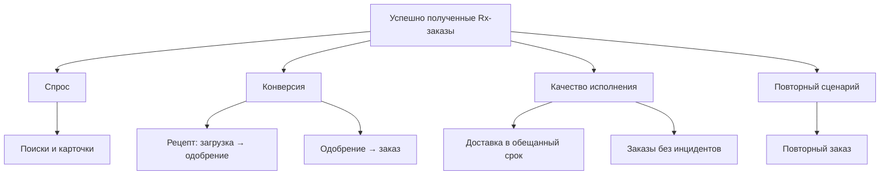

# Дерево метрик

## North Star Metric

**Количество успешно полученных заказов на рецептурные препараты без критичного инцидента за неделю.**

Метрика объединяет ценность для пользователя (получил нужное лекарство) и устойчивость процесса (заказ доставлен корректно).

## Основные метрики

| Блок | Метрика | Зачем |
| --- | --- | --- |
| Activation | Доля пользователей, увидевших наличие и начавших загрузку рецепта | Понимать, что путь понятен |
| Conversion | `одобренный рецепт / начатая проверка`; `заказ / одобренный рецепт` | Локализовать потери в воронке |
| Operations | Доля доставок вовремя; доля заказов без критичного инцидента | Не оптимизировать конверсию ценой качества |
| Retention | Повторный заказ за 30/60/90 дней для допустимых сценариев | Проверять ценность регулярного сервиса |
| Economics | Contribution margin на заказ; отмены; стоимость обработки рецепта | Контролировать устойчивость модели |

## Guardrails

Время проверки рецепта, доля отклонений/возвратов, обращения в поддержку на заказ, отмены после одобрения, NPS/CSAT после доставки, инциденты с персональными данными.

## События аналитики

`drug_search` · `drug_card_viewed` · `availability_viewed` · `prescription_upload_started` · `prescription_submitted` · `prescription_reviewed` · `checkout_started` · `order_created` · `delivery_status_changed` · `order_delivered` · `support_contacted`.

В событии не хранят медицинские данные: только технический статус, анонимный user/order ID, время и контекст шага.
